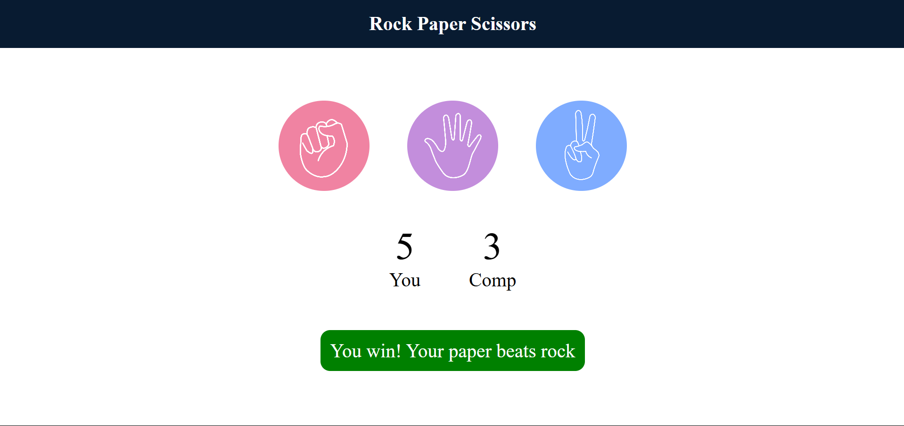
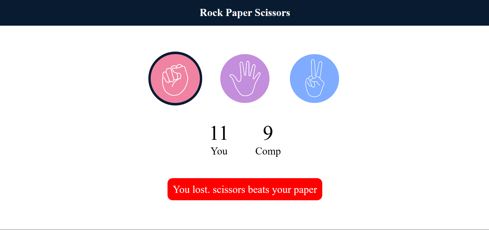
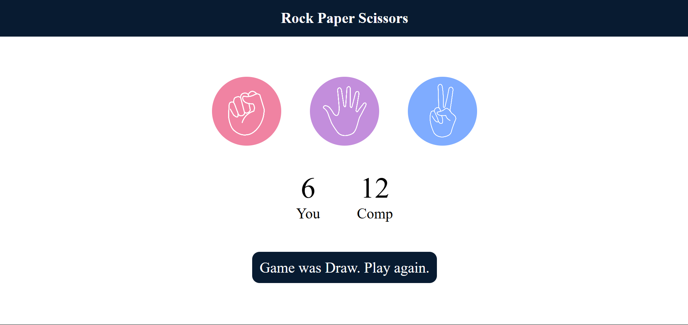

# Rock Paper Scissors Game

This is a simple **Rock Paper Scissors** game implemented using HTML, CSS, and JavaScript. The game allows the user to play against the computer, with the computer's choice being randomly generated.

## Features

- Interactive UI for selecting Rock, Paper, or Scissors.
- Dynamic score tracking for both the user and the computer.
- Displays messages indicating the result of each round (win, lose, or draw).
- Responsive design for a better user experience.

## How to Play

1. Open the `index.html` file in any modern web browser.
2. Click on one of the three choices: **Rock**, **Paper**, or **Scissors**.
3. The computer will randomly select its choice.
4. The result of the round will be displayed:
   - **Win**: Your choice beats the computer's choice.
   - **Lose**: The computer's choice beats your choice.
   - **Draw**: Both you and the computer selected the same option.
5. The scores will be updated accordingly.

## Example Outputs

### Win

### Lose

### Draw

